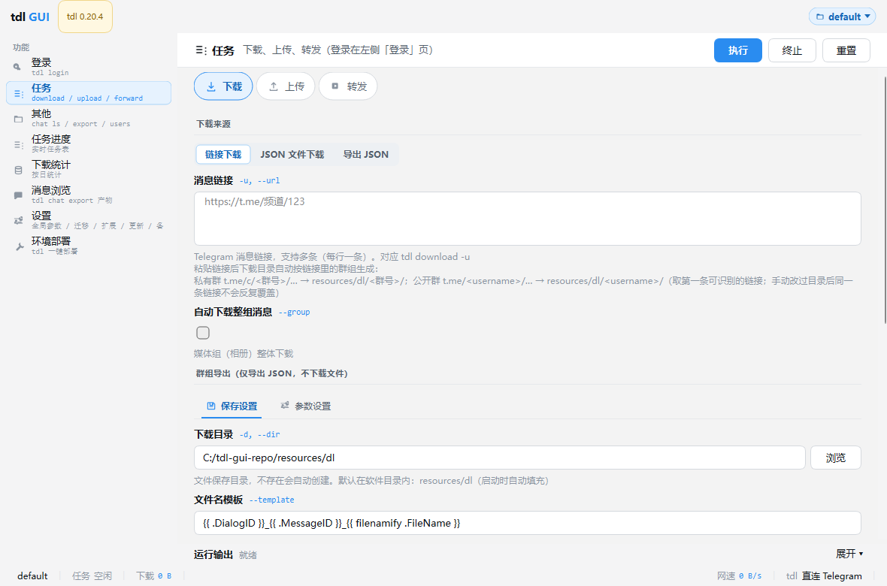
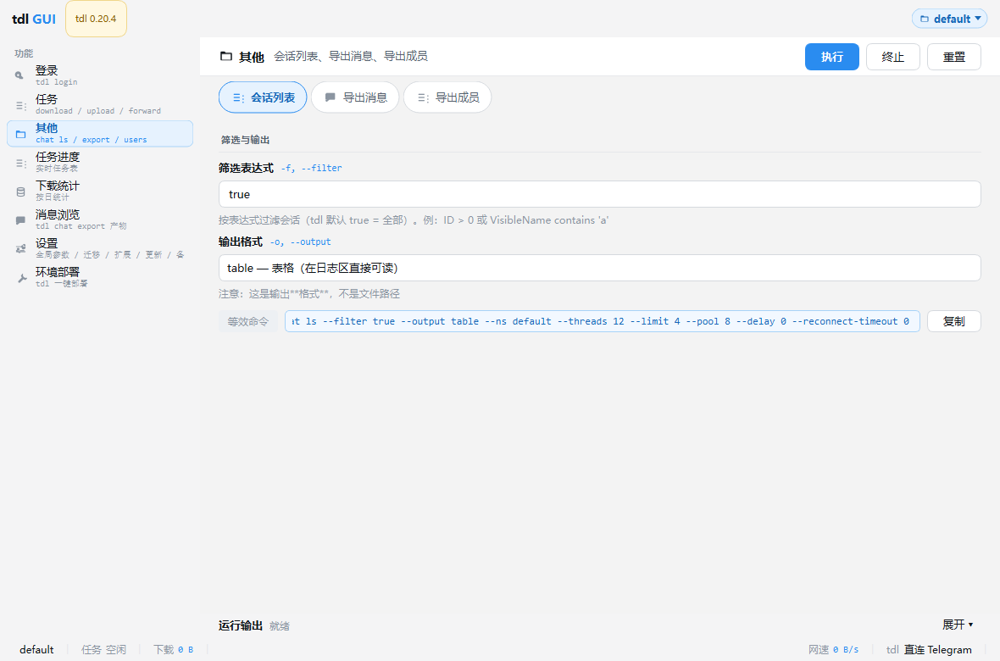
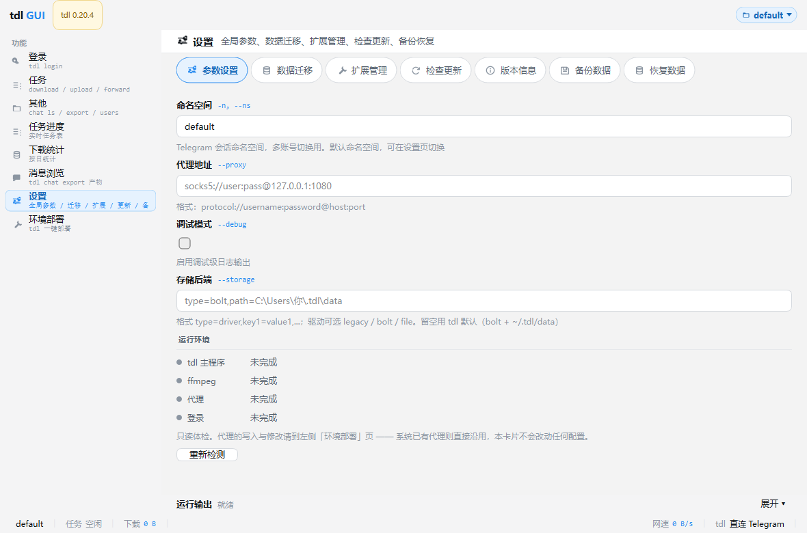
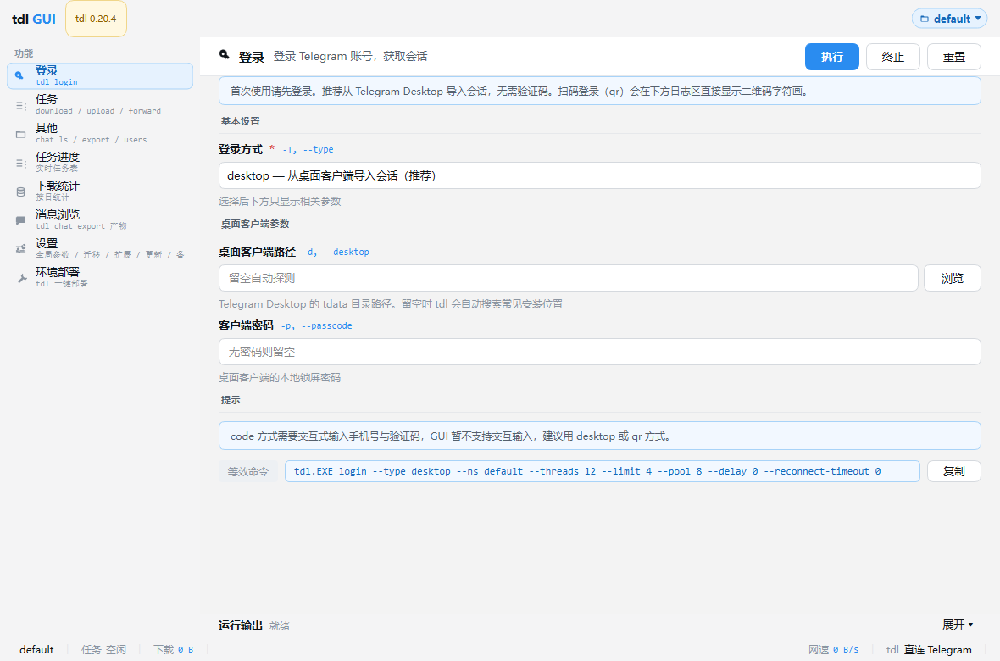
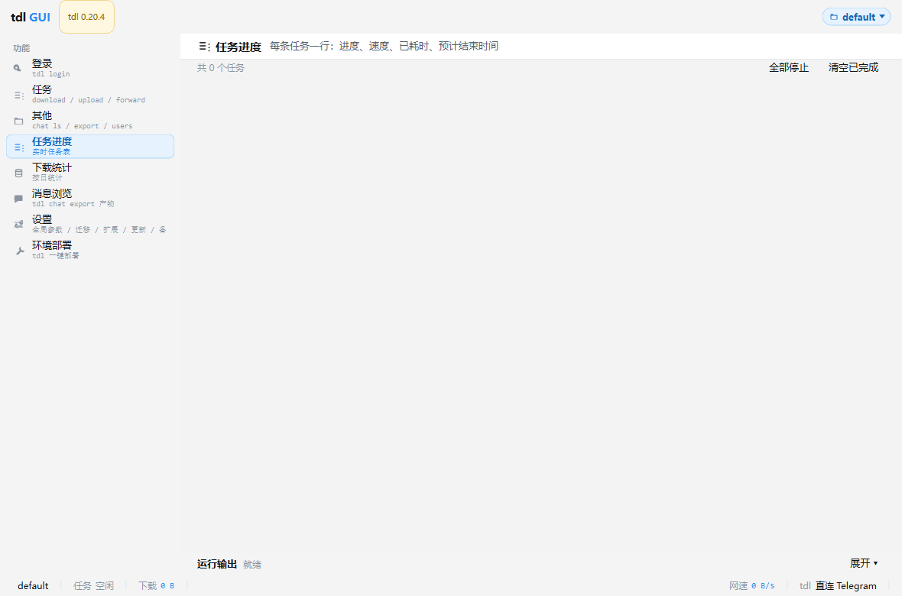
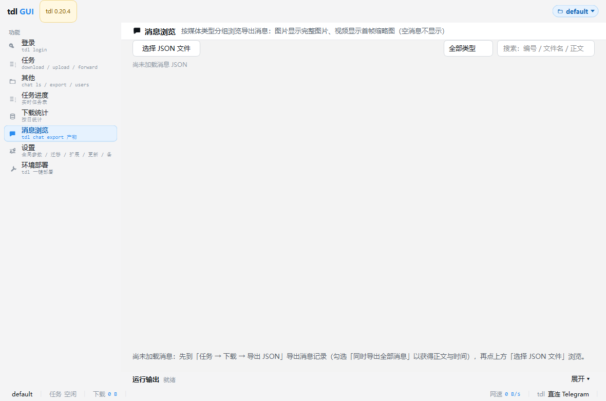

# tdl GUI

**Telegram 下载器 [iyear/tdl](https://github.com/iyear/tdl) 的 Qt 桌面客户端（PySide6 / Qt6），内置一键部署环境能力。**

把 tdl 的命令行能力包装成可视化操作：环境部署（装 tdl / ffmpeg、代理探测与修复、登录）+ 日常下载（下载 / 上传 / 转发 / 导出消息 / 浏览消息），一个窗口全搞定。

---

## 🖼 界面预览

**主界面 —— 左侧功能导航，右侧当前功能页**



**任务 · 下载** —— 链接下载 / JSON 文件下载 / 导出 JSON，粘贴链接后下载目录自动按群归类


**其他** —— 会话列表、导出消息、导出成员



**设置** —— 全局参数、数据迁移、扩展管理、检查更新、备份恢复



**登录** —— 扫码 / 验证码 / 复用桌面会话三种方式



**任务进度** —— 每条任务一行：进度、速度、已耗时、预计结束时间



**消息浏览** —— 按媒体类型分组浏览导出消息，图片视频内置预览



---

## ✨ 功能特性

- **环境部署页** —— 一键装好 tdl 主程序与 ffmpeg，写好 PATH 和环境变量，无需手动配置
- **代理自动探测** —— 自动发现本机运行的 Clash / Mihomo / Verge / v2ray / Xray / sing-box 等代理端口，协议探测 + 真实连通验证，选一个可用的即可
- **生效检测与一键修复** —— 7 项逐级验证代理是否真的被 tdl 用上（含系统时间偏差 / NTP 校准检查，MTProto 握手对时间敏感）
- **三种登录方式** —— 扫码（首选）/ 手机验证码 / 复用 Telegram Desktop 会话，内置官方 API 凭证，无需申请 api_id / api_hash
- **消息浏览与内置查看器** —— 导出消息后可直接浏览，图片 / 视频内置预览（QtMultimedia 缺失时自动退化为系统程序打开）
- **绿色便携** —— 整个文件夹可直接拷到别的机器用

---

## 🖥 运行环境

- Windows 10 / 11，64 位
- Python 3.10+ 与 [PySide6](https://pypi.org/project/PySide6/)（源码运行时）
- [tdl](https://github.com/iyear/tdl) 主程序（可由内置「环境部署」页自动下载安装）
- 一个能访问 Telegram 的代理

---

## 🚀 快速开始

```bash
# 1. 安装依赖
pip install -r requirements.txt

# 2. 启动
python main.py
```

首次使用四步走：

1. 左侧点 **「环境部署」**，看「环境状态」五项哪些标红 / 标黄
2. **「自动探测」** 找代理 → 选一个 ✓可用 的 → 点 **「⚡ 一键部署」**
3. 点 **「打开登录终端」**，手机 Telegram 扫码完成登录
4. 回到左侧 **「任务」**，选「下载」，填群链接开始用

> 已打包的压缩包无需装 Python，双击 `tdl-gui.exe` 即可运行。

---

## 🌐 代理配置

Telegram 服务器在海外，国内必须走代理，否则必然超时。

| 代理类型 | 格式 | 示例 |
|---|---|---|
| HTTP(S) | `http://IP:端口` | `http://127.0.0.1:7890` |
| SOCKS5 | `socks5://IP:端口` | `socks5://127.0.0.1:1080` |
| 带账号密码 | `http://用户:密码@IP:端口` | `http://u:p@1.2.3.4:7890` |

推荐用「自动探测」而不是手填：工具会扫正在运行的代理进程端口、读各客户端配置文件里的 `mixed-port` / `socks-port`（软件没开也能读到），再逐一做协议探测与连通验证。

**下载通道三档**：直连 GitHub（海外网络）/ 加速镜像（经 gh-proxy.com 中转，国内省事）/ 勾选「下载走代理」（有稳定本地代理时最可靠）。

---

## 🔑 登录 Telegram

tdl 内置官方 API 凭证，不需要自己申请 api_id / api_hash：

| 模式 | 命令 | 说明 | 推荐 |
|---|---|---|---|
| 扫码 | `tdl login -T qr` | 手机 Telegram「设置 → 设备 → 扫描二维码」 | ★ 首选 |
| 验证码 | `tdl login -T code` | 手机号（含 +86）+ 验证码 | 备选 |
| 桌面会话 | `tdl login -T desktop` | 复用本机已登录的 Telegram Desktop | 免验证码 |

> 验证码是 Telegram **App 内部推送**的（不是短信），一直收不到就用扫码模式。
> 多账号用「命名空间」隔离，如 `tdl -n <namespace> login -T qr`。

---

## 🔧 环境变量

部署会写入以下**用户级**环境变量（HKCU，无需管理员），只对新启动的进程生效：

| 变量 | 含义 | 默认 |
|---|---|---|
| `TDL_PROXY` | 代理地址 | 空 |
| `TDL_THREADS` | 单任务线程 | 8 |
| `TDL_LIMIT` | 并发任务 | 6 |
| `TDL_POOL` | DC 连接池 | 5 |
| `TDL_SIZE` | 分片大小 | 262144 |
| `TDL_RECONNECT_TIMEOUT` | 重连超时 | 0 |
| `TDL_NTP` | NTP 时间源 | 空 |

---

## ❓ 常见问题

| 现象 | 原因与处理 |
|---|---|
| 下载 GitHub 一直转圈 | 换「加速镜像」或勾选「下载走代理」 |
| 杀软报毒 / 文件被删 | tdl.exe、ffmpeg.exe 无签名，属误报，加白名单 |
| `not authorized` | 没登录或命名空间不对；**注意此时网络是通的** |
| 连接超时 / reset | 代理未生效，重启程序后「检测生效」逐项排查 |
| 代理明明通却连不上 | **查系统时间**，偏差过大用「一键修复」配 NTP |
| 改了环境变量不生效 | 已运行程序不重读，重启程序 / 终端 |
| 下载中途断流 | `TDL_POOL` 降到 3~5、`TDL_LIMIT` 降到 3~4 |

---

## 📁 目录结构

```
tdl-qt-client/
├─ main.py                   # 入口
├─ app/                      # 代码（data / runner / deploy / envcheck …）
├─ resources/
│  ├─ json/                  # 下载 json（运行时生成）
│  └─ dl/                    # 下载的文件（按「缩写-群号」分文件夹，运行时生成）
├─ tdl.exe                   # ← 部署后落在这里
├─ ffmpeg.exe                # ← 部署后落在这里
├─ tdlx.cmd                  # ← 修复时生成的代理兜底脚本
└─ deploy-state.json         # ← 部署后生成的接口契约文件
```

---

## 📋 免责声明

本工具仅为 tdl 的图形界面与部署辅助，**不提供代理服务、不提供任何翻墙手段**。
Telegram 的使用与合规责任由使用者自行承担。请遵守当地法律法规。

---

## 🙏 致谢

- [iyear/tdl](https://github.com/iyear/tdl) —— 强大的 Telegram 下载器 CLI
- [Qt for Python (PySide6)](https://doc.qt.io/qtforpython/) —— 官方 Python Qt 绑定
